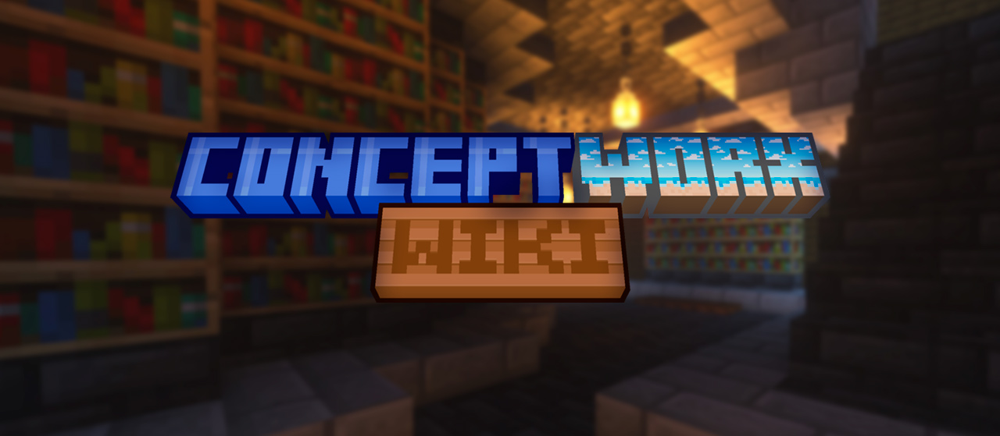

# ConceptWorx [!badge variant="info" text="Wiki"]

---

## Добро пожаловать на Wiki проекта ConceptWorx

Здесь собрана вся важная информация о нашем проекте: правила, гайды и многое другое.

[!badge variant="dark" target="blank" text="GitHub"](https://github.com/ddimavo/ConceptWorx.Wiki)

---

  

## О проекте

**ConceptWorx** — это уникальный Minecraft-проект с уклоном в ванильное выживание.

### Особенности сервера:
- **Уникальные механики**: кастомные зачарования и генерация мира, прокачка навыков и умений, кланы
- **Активное сообщество**: регулярный онлайн, сообщества игроков
- **Стабильность и защита**: защита от гриферов и читеров
- **Обновляемый контент**: новые локации, фишки и иные механики

Присоединяйся к нам по IP: `mc.conceptworx.ru`

---

## Полезные ссылки

[!ref target="blank" icon= "globe" text="Официальный сайт"](https://conceptworx.ru/)
[!ref target="blank" icon="person-add" text="Discord"](https://discord.gg/9ShFHWp28G)
[!ref target="blank" icon="book" text="Правила проекта"](https://conceptworx.ru/rules/)
[!ref target="blank" icon="paper-airplane" text="Telegram"](https://t.me/CWS_chat)
[!ref target="blank" icon="location" text="Динамическая карта"](https://conceptworx.ru/map/)

---

## Быстрый старт

[!ref Приват территории](/basics/regionclaiming.md)
[!ref Кастомные зачарования](/exenchant/enchantments.md)
[!ref Навыки и прокачка персонажа](/mcmmo/skills.md)
[!ref Союзы](/mcmmo/party.md)

📨 По вопросам сотрудничества и нарушений пишите в **Telegram** или сообщайте через формы на сайте.

---

🚀 **Приятной игры на сервере!**  

